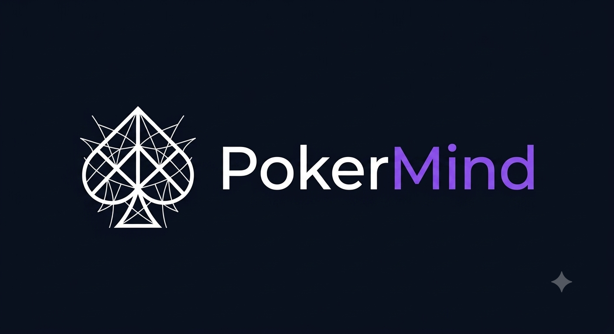

<p align="center">
  
</p>

<p align="center"><strong>Piensa. Decide. Mejora.</strong></p>

Un juego para aprender a tomar buenas decisiones en el póker usando probabilidades.
**Sin dinero. Sin suerte. Solo tú y tu mente.**

En el póker normal puedes jugar bien y aun así perder por mala suerte, o jugar mal y ganar de
casualidad. Por eso es difícil saber si de verdad estás aprendiendo. Aquí eso no importa: el juego
te dice al instante si tu decisión era buena **según las probabilidades reales**, y te explica por
qué. Ganas puntos por pensar bien, no por tener suerte.

---

## Los dos modos

**Entrenador** — un curso de **9 módulos y 41 lecciones** que empieza en «qué es una ciega» y termina
en nociones de equilibrio. Una idea por lección y a practicarla enseguida: no se avanza por pulsar
«siguiente», se avanza cuando aciertas seguido.

**Modo libre** — un torneo corto contra tres bots, con fichas y ciegas que suben. Cada bot tiene un
carácter distinto que se sortea al empezar la partida y no se revela hasta el final, porque leer al
rival es parte del juego. Los puntos siguen siendo por decidir bien: puedes quedar último habiendo
jugado estupendamente.

## Lo que hace distinto a este juego

El motor no compara «tu probabilidad contra el precio» y ya. Calcula el **valor esperado de
retirarse, pagar y subir contra las manos que el rival puede tener**, y tiene en cuenta cómo va a
reaccionar. Por eso entiende cosas que una calculadora no:

- con una mano enorme contra alguien que lo paga todo, te dice **apuesta**;
- con la misma mano contra alguien que se va a retirar, te dice **escóndela y deja que apueste él**.

Los números están comprobados contra las calculadoras de referencia del póker (AA contra KK: 82,3 %;
AK contra QQ: 43,2 %) y el evaluador de manos se verifica contra fuerza bruta en los tests.

## Empezar

```bash
npm install
npm run dev
```

| Comando | Qué hace |
|---|---|
| `npm run dev` | Arranca en desarrollo |
| `npm run build` | Compila para publicar |
| `npm test` | Los 112 tests |
| `npm run typecheck` | Comprueba los tipos |

El juego funciona **sin servidor**: el progreso se guarda en el aparato. Para activar las cuentas
con correo y contraseña, mira [`docs/servidor.md`](docs/servidor.md).

Se puede **instalar en el móvil** desde el navegador y jugar **sin conexión**.

## Cómo está organizado

```
src/
├── motor/        Reglas, probabilidades y evaluación de decisiones. No sabe nada de pantallas.
│   ├── evaluador.ts    Mejor mano de 5 entre 7, con máscaras de bits
│   ├── equity.ts       Probabilidades: exactas cuando caben, simuladas cuando no
│   ├── rangos.ts       Las manos que puede tener el rival
│   ├── decision.ts     EL CORAZÓN: valor esperado de cada acción y puntuación
│   ├── mesa.ts         Hold'em completo: ciegas, todo-in, botes paralelos
│   ├── bot.ts          Los bots, con el mismo motor y su propio carácter
│   └── torneo.ts       El torneo del modo libre
├── juego/        Lecciones, progreso, repaso espaciado, sesiones
├── contenido/    Los 9 módulos del temario y el glosario
├── almacen/      Guardado local, sincronización y cuentas
└── ui/           Pantallas y componentes
```

El motor está **separado de la interfaz** a propósito: lo usan igual el entrenador, el modo libre y
los bots, y el día que haya multijugador podrá correr en un servidor sin reescribirlo.

## Cómo se decidió todo esto

En [`.mega-cuestionario/Guía para PokerMind.md`](.mega-cuestionario/Guía%20para%20PokerMind.md) está
la historia completa: qué se preguntó, qué se decidió, qué se descartó y por qué. Incluye el análisis
de **qué hace bueno a un tutorial** del que salió la forma del modo entrenador.
